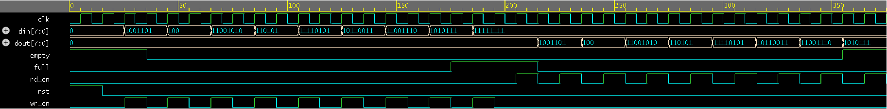

# Verification of Synchronous FIFO — Directed Testing

## Overview
Designed and verified a synchronous FIFO (First In First Out) memory using 
Verilog RTL and a SystemVerilog directed testbench. Simulation performed 
using Aldec Riviera-PRO on EDA Playground.

## Specifications
- FIFO Depth: 8
- Data Width: 8-bit
- Design: Synchronous (single clock)

## Tools Used
- SystemVerilog / Verilog
- Aldec Riviera-PRO (EDA Playground)
- EPWave Waveform Viewer

## Verification Plan
| Test Case | Description | Result |
|-----------|-------------|--------|
| Test 1 | Write 8 values — fill FIFO completely | PASS |
| Test 2 | Verify Full flag assertion | PASS |
| Test 3 | Write when Full — verify ignored | PASS |
| Test 4 | Read all 8 values sequentially | PASS |
| Test 5 | Verify Empty flag assertion | PASS |
| Test 6 | Read when Empty — verify ignored | PASS |

## Waveform

## Key Observations
- Empty flag deasserts correctly after first write
- Full flag asserts correctly after 8 writes
- Write when Full is correctly ignored by design
- Read when Empty is correctly ignored by design
- One cycle read latency observed — standard behavior 
  for synchronous registered output FIFO

## File Structure
- `fifo_sync.v` — Synchronous FIFO RTL design
- `fifo_tb.sv` — Directed SystemVerilog testbench
- `waveform.png` — Simulation waveform output

## Skills Demonstrated
SystemVerilog | Directed Testing | RTL Verification | 
Waveform Analysis | Functional Debugging
